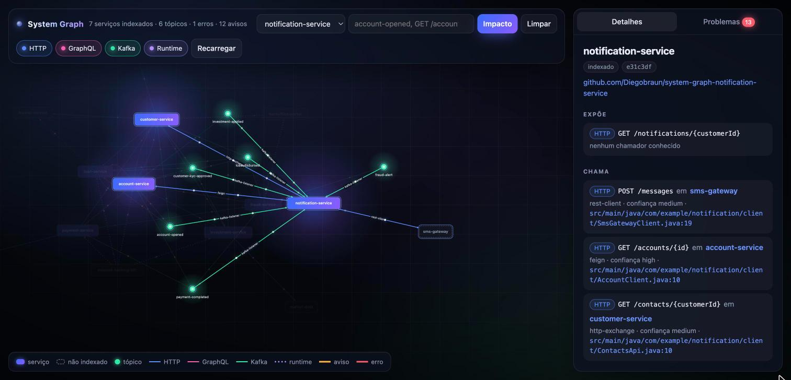

# notification-service

Serviço de notificações. Só consome: escuta seis tópicos com **spring-kafka** (`@KafkaListener`) e avisa o
cliente. Descobre o dono da conta no account-service com **OpenFeign**, busca o contato no customer-service com
**HTTP Interface (`@HttpExchange`)** e manda SMS pelo sms-gateway com **`RestClient`**.



*O notification-service na [interface visual](https://github.com/Diegobraun/system-graph-poc#interface-visual) da plataforma: tudo que ele chama, expõe, publica e consome.*

## Contratos

| Tipo | Contrato | Detalhe |
|---|---|---|
| REST exposto | `GET /notifications/{customerId}` | notificações enviadas para o cliente |
| REST chamado | `GET /accounts/{id}` no account-service | `AccountClient`, `@FeignClient(name = "account-service")` |
| REST chamado | `GET /contacts/{customerId}` no customer-service | `ContactsApi`, interface `@HttpExchange` criada em `ClientsConfig` |
| REST chamado | `POST /messages` no sms-gateway | `SmsGatewayClient`, `RestClient` |
| Kafka consome | `account-opened` | conta aberta e em análise |
| Kafka consome | `customer-kyc-approved` | cadastro aprovado, conta ativa |
| Kafka consome | `loan-disbursed` | empréstimo creditado |
| Kafka consome | `payment-completed` | Pix enviado |
| Kafka consome | `investment-applied` | aplicação confirmada |
| Kafka consome | `fraud-alert` | Pix fora do padrão, pede confirmação |

Os listeners ficam em `NotificationListeners` e os payloads em `Events`, cada um com só os campos que a mensagem
usa. Todos os tópicos vêm de propriedades (`${app.topics.*}`).

## Regras

- `account-opened`, `customer-kyc-approved` e `investment-applied` já trazem `customerId`. Os outros três trazem só
  `accountId`, e o cliente sai do `GET /accounts/{id}`.
- Canal: SMS se o contato tem telefone, e-mail se tem só e-mail, senão `app`. E-mail e `app` são apenas
  registrados, não há envio real.

## Serviços externos

O sms-gateway (`localhost:8096`) não sobe localmente. A conexão é recusada na hora e a notificação fica registrada
com `delivered: false`. Sem resposta do customer-service o contato é tratado como vazio e o canal vira `app`.

## Rodando sozinho

```bash
mvn spring-boot:run
```

Porta 8085. Precisa do Kafka em `localhost:9092` e do account-service em `localhost:8081` para os eventos que só
têm `accountId`. O Kafka sobe com o `docker-compose.yml` da [plataforma](https://github.com/Diegobraun/system-graph-poc),
e o `scripts/start-all.sh` de lá sobe todos os serviços juntos.

## Parte da POC system-graph

Este repositório é um dos serviços da POC [system-graph](https://github.com/Diegobraun/system-graph-poc), que dá a assistentes de IA uma visão
dos contratos entre serviços que vivem em repositórios diferentes.

| Repositório | Papel |
|---|---|
| [system-graph-poc](https://github.com/Diegobraun/system-graph-poc) | Plataforma: extrator, MCP server, templates de CI, docker-compose e docs |
| [system-graph-account-service](https://github.com/Diegobraun/system-graph-account-service) | Clientes e contas |
| [system-graph-loan-service](https://github.com/Diegobraun/system-graph-loan-service) | Empréstimos |
| [system-graph-customer-service](https://github.com/Diegobraun/system-graph-customer-service) | KYC e perfil de risco |
| [system-graph-payment-service](https://github.com/Diegobraun/system-graph-payment-service) | Pagamentos Pix |
| [system-graph-notification-service](https://github.com/Diegobraun/system-graph-notification-service) | Notificações |
| [system-graph-investment-service](https://github.com/Diegobraun/system-graph-investment-service) | Investimentos |
| [system-graph-fraud-service](https://github.com/Diegobraun/system-graph-fraud-service) | Antifraude |

### O que este repositório tem para o grafo

- **`.github/workflows/system-graph.yml`**: a cada push na `main`, compila, baixa o `graph-extractor.jar` da
  release da plataforma, extrai o `service-graph.json` e publica como artefato do workflow. Se os secrets
  `NEO4J_URI`, `NEO4J_USER` e `NEO4J_PASSWORD` existirem, também grava no Neo4j.
- **`.gitlab-ci.yml`**: o mesmo job no formato GitLab, incluindo o template da plataforma. É o que um serviço da
  empresa teria.
- **`.mcp.json`** e **`CLAUDE.md`**: conectam o assistente ao MCP server e dizem quando consultar o grafo.

O extrator só enxerga este repositório. O cruzamento com os outros serviços acontece no grafo central.
